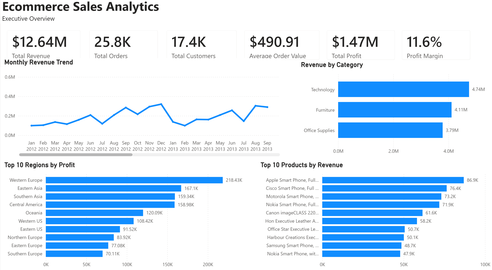
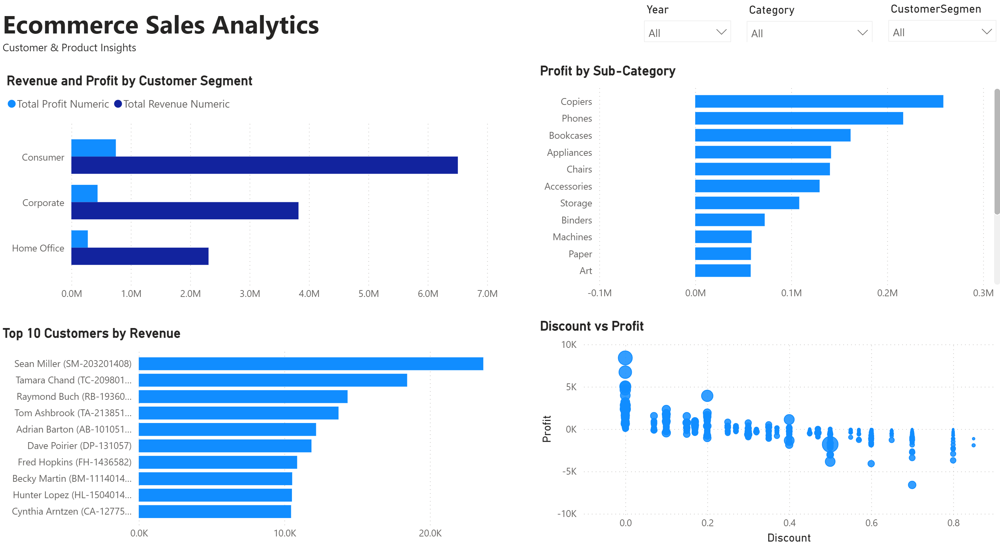
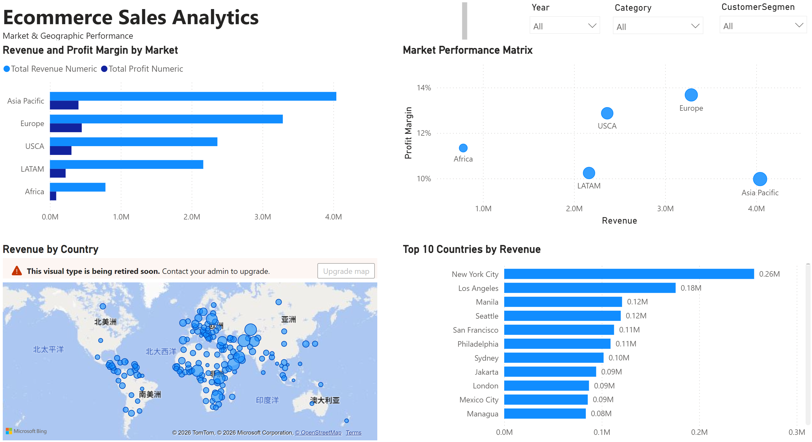

# Ecommerce Sales Analytics

## Project Overview

This project presents an interactive Power BI dashboard developed to analyse ecommerce sales performance, profitability, customer behaviour, product contribution and geographic market performance.

The dashboard transforms transactional data into actionable business insights across three analytical pages:

1. Executive Overview
2. Customer & Product Insights
3. Market & Geographic Performance

## Business Objectives

The analysis was designed to answer the following business questions:

- How are revenue, profit and order volume changing over time?
- Which categories, sub-categories and products generate the most revenue and profit?
- Which customer segments contribute the highest business value?
- How does discounting affect profitability?
- Which markets, regions and cities perform best?
- Where are the main opportunities for revenue growth and margin improvement?

## Tools and Skills

- Power BI
- Power Query
- DAX
- Data Modelling
- Data Cleaning
- KPI Development
- Customer Segmentation
- Product Performance Analysis
- Geographic Analysis
- Business Insight Generation

## Dashboard Structure

### Executive Overview

This page provides a high-level view of overall ecommerce performance through:

- Total Revenue
- Total Orders
- Total Customers
- Average Order Value
- Total Profit
- Profit Margin
- Monthly Revenue Trend
- Revenue by Category
- Top Regions by Profit
- Top Products by Revenue

### Customer & Product Insights

This page analyses customer and product-level performance through:

- Revenue and Profit by Customer Segment
- Profit by Sub-Category
- Top Customers by Revenue
- Discount versus Profit Analysis

### Market & Geographic Performance

This page evaluates geographic and market performance through:

- Revenue and Profit Margin by Market
- Market Performance Matrix
- Geographic Revenue Distribution
- Top Cities by Revenue

## Key Insights

- Revenue is concentrated among several high-performing product categories and customer groups.
- Some high-revenue products and regions generate comparatively weaker profit margins.
- Discounting does not always improve profitability and requires more targeted control.
- Geographic performance varies significantly across markets and cities.
- Customer and product-level analysis can help prioritise high-value segments and improve resource allocation.

## Live Dashboard

[View the Interactive Power BI Dashboard](https://app.powerbi.com/view?r=eyJrIjoiYzFhYzc0MTYtNTgyYS00ZDRkLTlmM2UtNzEzODM0YzQxMzM5IiwidCI6IjIzMzg4ZmU5LWJlNmQtNDIxMy05OTc4LWE4YzljNjA2N2Y3NiIsImMiOjEwfQ%3D%3D)

## Dashboard Preview

### Executive Overview

### Customer & Product Insights

### Market & Geographic Performance

