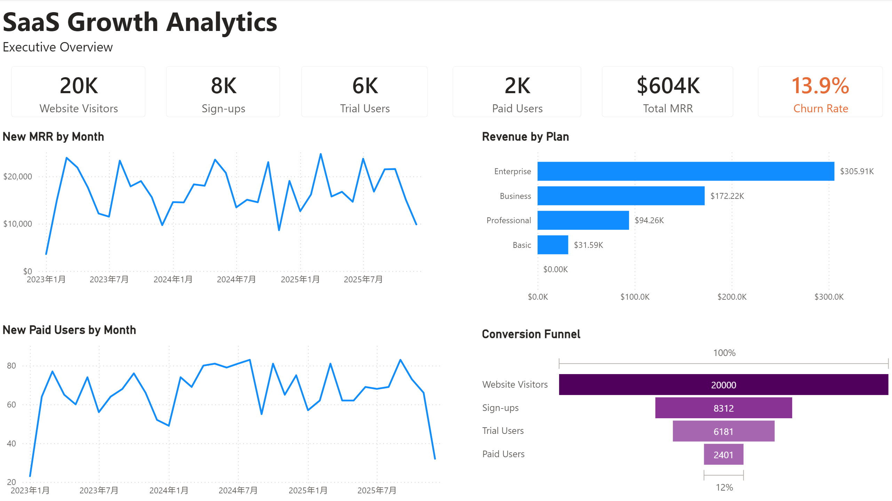
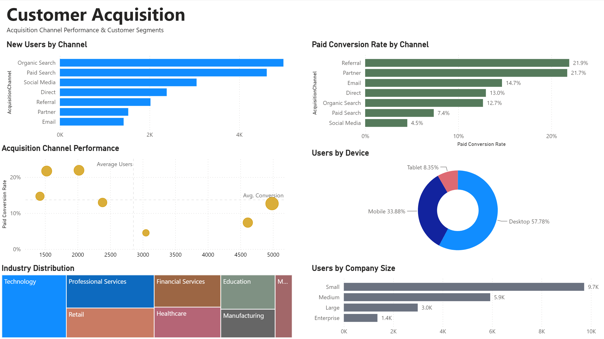
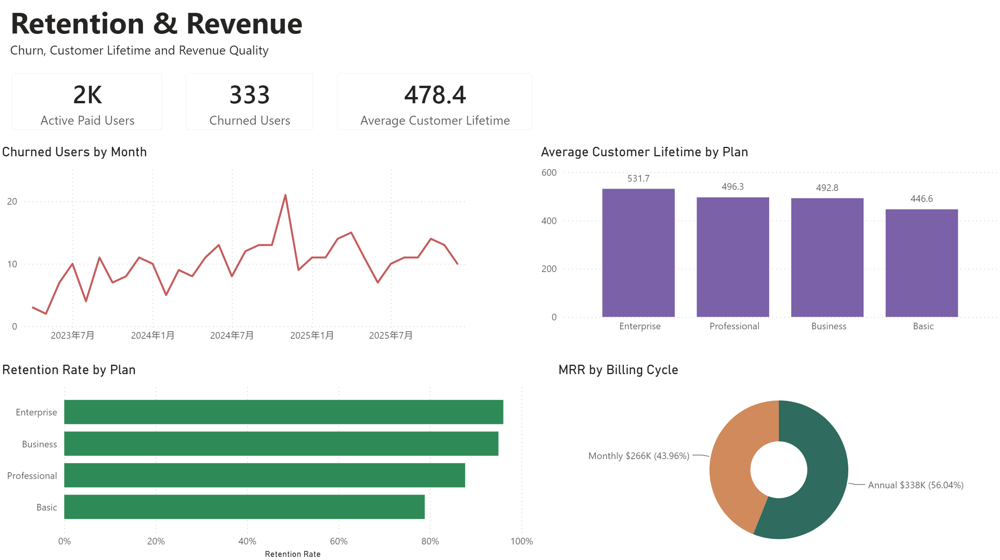

# SaaS Growth Analytics Dashboard

## Project Overview

This project presents an end-to-end SaaS analytics dashboard developed in Power BI. It evaluates business growth, customer acquisition performance, conversion efficiency, customer retention, churn, and recurring revenue.

The dashboard is organised into three pages:

1. Executive Overview
2. Customer Acquisition
3. Retention & Revenue

## Business Questions

- How effectively are website visitors converting into paid customers?
- Which acquisition channels generate the most users?
- Which channels achieve the strongest paid conversion rates?
- Which customer segments contribute the most revenue?
- How do churn and retention vary across subscription plans?
- How do annual and monthly billing cycles contribute to MRR?

## Dashboard Pages

### Executive Overview

This page summarises the main SaaS performance indicators, including:

- Website Visitors
- Sign-ups
- Trial Users
- Paid Users
- Total MRR
- Churn Rate
- Monthly paid-user trends
- Revenue by subscription plan
- Conversion funnel

### Customer Acquisition

This page evaluates the scale and quality of customer acquisition through:

- New Users by Channel
- Paid Conversion Rate by Channel
- Acquisition Channel Performance Matrix
- Device Distribution
- Industry Distribution
- Company Size Distribution

The Acquisition Channel Performance Matrix combines user volume, paid conversion rate, and MRR contribution to identify high-quality acquisition channels.

### Retention & Revenue

This page evaluates customer retention and revenue quality through:

- Active Paid Users
- Churned Users
- Average Customer Lifetime
- Churned Users by Month
- Retention Rate by Plan
- Average Customer Lifetime by Plan
- MRR by Billing Cycle

## Tools and Techniques

- Power BI
- Power Query
- DAX
- Data Modelling
- Star Schema
- Customer Funnel Analysis
- SaaS Metrics Analysis
- Business Intelligence
- Data Visualisation

## Key Insights

- Organic Search generates the largest user volume and the highest overall revenue contribution.
- Referral and Partner channels achieve strong paid conversion rates despite having lower user volume.
- Paid Search and Social Media generate considerable traffic but show weaker paid conversion performance.
- Enterprise customers demonstrate the longest average customer lifetime.
- Annual subscriptions contribute a larger share of MRR than monthly subscriptions.
- Retention performance is stronger among higher-tier subscription plans.

## Live Dashboard

[View the Interactive Power BI Dashboard](https://app.powerbi.com/view?r=eyJrIjoiZTZhOThmYzQtY2I1NS00ODlkLTlkMWQtZTZmN2Y1OTNhYzc4IiwidCI6IjIzMzg4ZmU5LWJlNmQtNDIxMy05OTc4LWE4YzljNjA2N2Y3NiIsImMiOjEwfQ%3D%3D)

## Dashboard Preview

### Executive Overview

### Customer Acquisition

### Retention & Revenue

